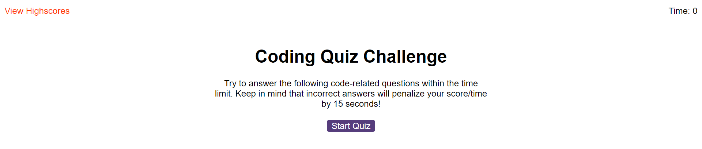
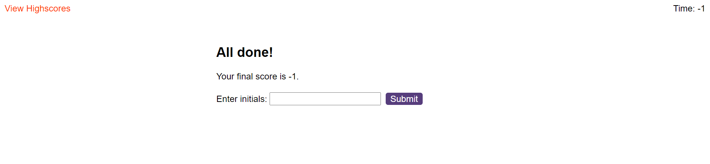

#Javascript_Quiz-code

Coding Quiz using JavaScript APIs

JavaScript_Quiz-code was to build and online quiz by manipulating the DOM. The user answers a series of multiple choice questions. If a wrong answer is given time is deducted from the amount of time remaining. At the end of the quiz the user’s final time (score) and initials are logged. Participants are ranked according to their score. No starter code was given. I had to build the html, css and js files. This project utilized and increased my knowledge of:
 
event listeners,
timers/intervals and interval clears,
text content,
local storage, and
query selectors.
 
 
#Steps
GIVEN I am taking a code quiz
WHEN I click the start button
THEN a timer starts and I am presented with a question
WHEN I answer a question
THEN I am presented with another question
WHEN I answer a question incorrectly
THEN time is subtracted from the clock
WHEN all questions are answered or the timer reaches 0
THEN the game is over
WHEN the game is over
THEN I can save my initials and my score
 
 
 #performers

 
